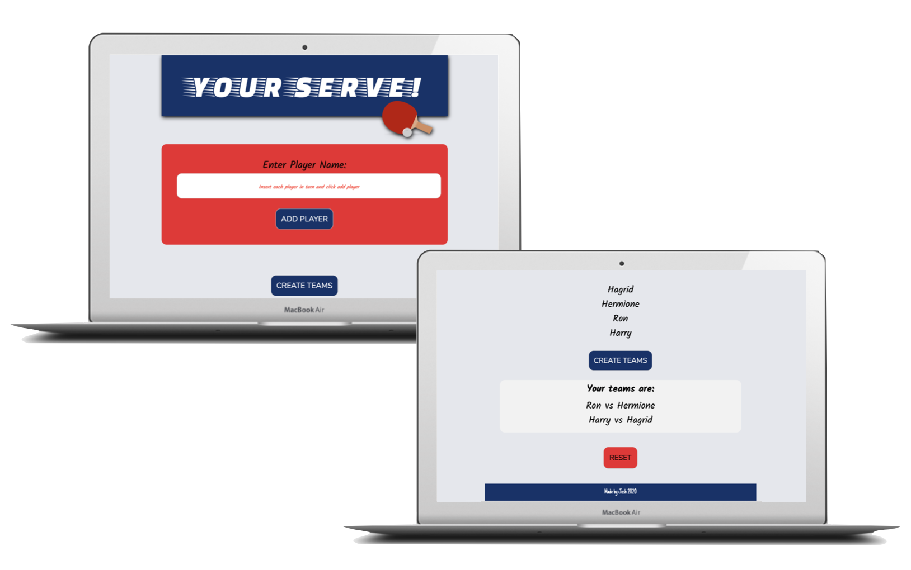
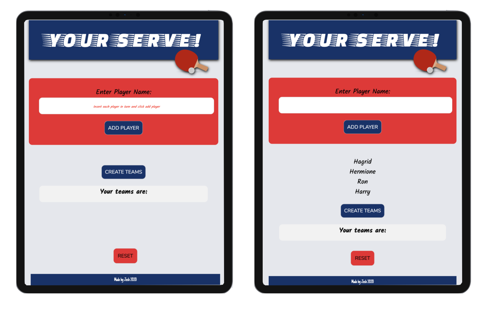
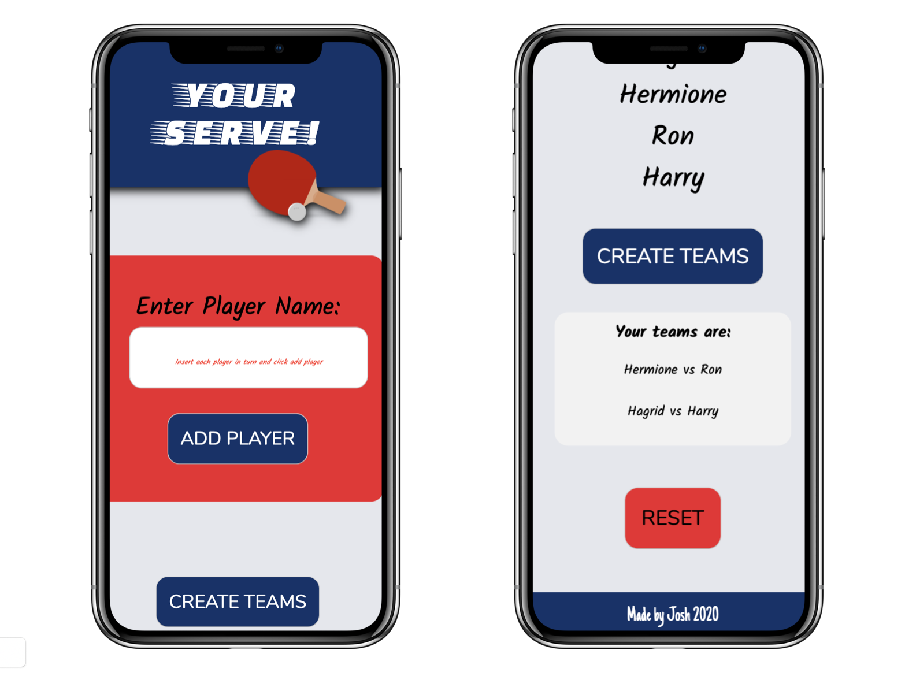

## YOUR SERVE! - The Table Tennis Team Generator

## How to set up:

1. Git clone or download the repository as a zip file 
2. Open the index.html file in your browser

You can view the live site here: https://joshm92.github.io/pingpongpicker/

## Technologies and Skills used:
HTML, CSS, JavaScript, Git, Wireframing, Google Dev Tools

## The brief: 
The core of the challenge is to create a tool which randomly creates pairings for a table tennis tournament bracket from a list of names collected from the user.

It's up to you how you implement this, with JavaScript, React, or PHP, as a web page, or as an app.

Some **optional** advanced features might include:
* ability to record scores for each player, or mark which player won from each pairing, to create the next round of the tournament playoffs
* continued rounds created until the final (last 2 players who have won all matches to date play each other, one marked as the winner)

You should document what you have done and why, to demonstrate your planning process, and clear thinking.

If your tool requires a particular environment to run (e.g. Node or PHP) then this should be documented (as a readme.md?) with instructions provided (e.g. a Vagrantfile, package.json, gulpfile.js etc.). In short: I shouldn't struggle to get it working on my local machine, and you shouldn't assume I know how it is supposed to work.

You might want to show your experience and competence with Git by version managing your project from the start and providing a link to the repository on GitHub.

## Build approach:
After looking at the brief and coming up with a scamp, I started to approach this app with three main things in mind: 

1. **Easy to use interface from a UX and functionality point of view.** To achieve this I wanted the tool to have minimal but clear buttons and a nice simple to use interface.
2. **Compatibility for small screens.** Due to the nature of this tool, it’s more than likely that most users will be using this on their mobile devices so making sure that the tool can be used on smaller screens was very important.
3. **Accessibility.** I think accessibility is extremely important even for a small tool such as this. To achieve this I wanted large buttons and a simple colour theme.

## Programming approach:
As soon as I looked at the brief I knew that the JavaScript would need to involve a math.random function. I started experimenting with the functionality by mocking up a simple HTML and Javascript file. This allowed me to try out and test code and make sense of what each bit of functionality had to do. Essentially to reach an MVP the tool will need to be able to: **Take a user input of multiple names** > **Store those names in an array** > **Shuffle the array and push out items into arrays of two names.**

## Wireframes Large/Medium/Small screen:

## Mockups Large/Medium/Small screen:

## Testing:
I used the Google Dev Tools to test my site on various screen sizes. I've also tested the site across Firefox and Safari. 

## Further aims:
**Delete/Edit player:** I would like to create an option to edit or delete a player once inputted by the user.

**Shuffle button:** I would like to create a shuffle button to re-shuffle the players that have been generated.

**Score record:** Recording scores for each player and marking who the winner is.

**Dark mode:** I would like to have a toggle button that toggles the site between light and dark mode.
